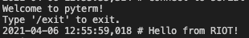
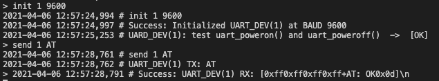
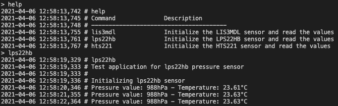

# p-nucleo-lrwan

In the directory projet-RIOT-LRWAN3, you will find three RIOT applications. They were designed to be compiled and flashed on a nucleo-l073rz board.

Note : You must have the [RIOT base directory](https://github.com/RIOT-OS/RIOT) cloning in your computer. Change the following line in each **Makefile** to match the correct path :

    # Path to the RIOT base directory
    RIOTBASE ?= $(CURDIR)/../../../RIOT

## How to compile and flash 

Place yourself in one of the three directory *AT-command* - *hello-world* - *sensors*, depending on which application you want to test. Then, just run this command in your terminal in order to compile the program and flash the firmware produced into your board.

    gmake BOARD=nucleo-l073rz flash term

## Hello World

It's a simple RIOT application which just print out "Hello from RIOT".

Here is the result expected :

## AT command

This RIOT application allows you to use the nucleo-l073rz board to control the LRWAN-NS1 expansion board with AT commands via UART. 

The shell command **help** will show you the different shell commands you can run with their specificity and goal.

Firstly you have to init the right UART (which is UART1 corresponding to PA9 and PA10 pins) with the baudrate 9600

    init 1 9600

Then, you can send an AT command using send \<dev> \<cmd> 

You can expect the following result :

## Sensors

This RIOT application allows you to initialize and read values from the sensor choosen with shell commands.

You can initialize and read values from the lis3mdl, hts221 and lps22hb LRWAN-NS1 sensors.

The shell command **help** will show you the different shell commands you can run with their specificity and goal.

You can expect the following result :

